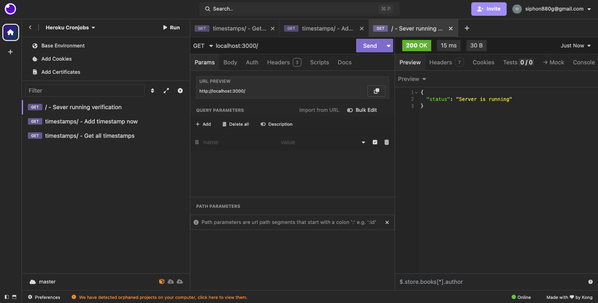
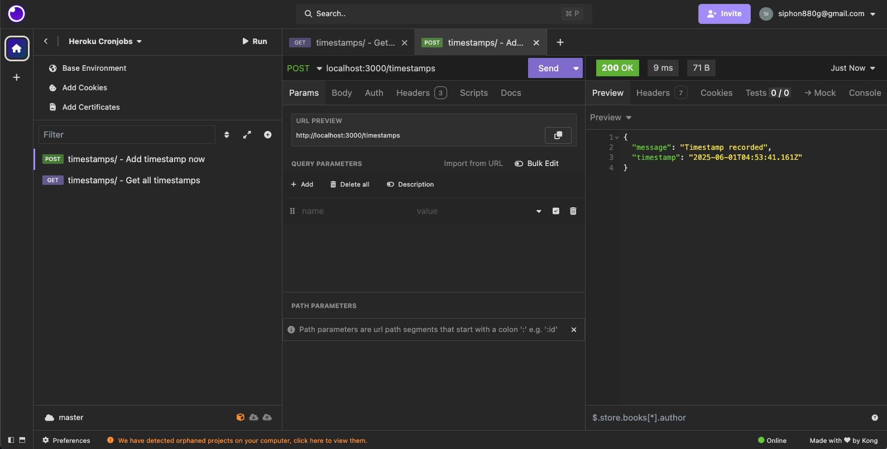
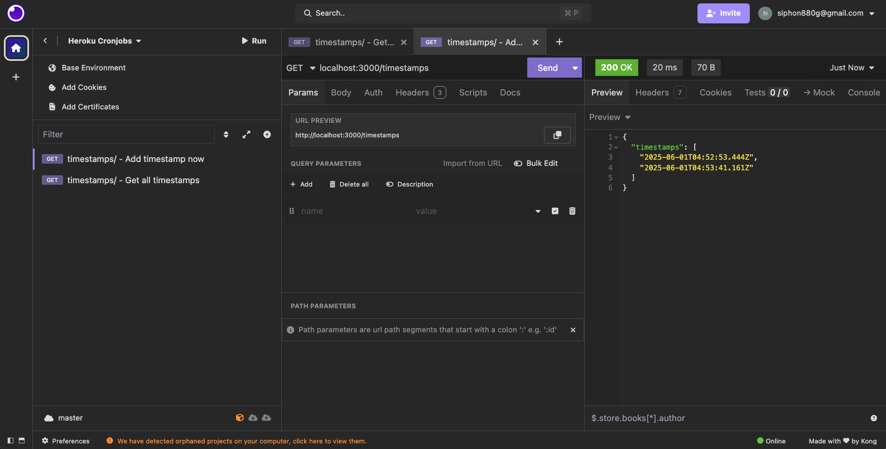

# Heroku Cronjob Dyno

<a target="_blank" href="https://github.com/Siphon880gh" rel="nofollow"></a>
<a target="_blank" href="https://www.linkedin.com/in/weng-fung/" rel="nofollow"></a>
<a target="_blank" href="https://www.youtube.com/@WayneTeachesCode/" rel="nofollow"></a>

---

## 📝 Overview

By Weng Fei Fung (Weng). This sets up a simple API endpoint to test and verify that a scheduled **Heroku dyno** (cron job) is running correctly. Every time the dyno pings the endpoint, the server logs the hit. After 5 successful hits, the job stops—helping confirm that your Heroku Scheduler is working as expected.

---

## 🚀 How It Works

1. Deploy the app to Heroku.
2. Use the [Heroku Scheduler add-on](https://devcenter.heroku.com/articles/scheduler) to run a scheduled dyno.
3. The dyno makes a request to the API endpoint.
4. Each request is logged and stored.
5. After 5 total hits, logging stops to prevent unnecessary storage.

## 📡 API Endpoints

### GET /
Returns the server status.
```json
{
    "status": "Server is running"
}
```



### POST /timestamps/
Records a new timestamp in the timestamps.log file.
```json
{
    "message": "Timestamp recorded",
    "timestamp": "2024-03-21T12:34:56.789Z"
}
```



### GET /timestamps/
Lists all recorded timestamps from the timestamps.log file.
```json
{
    "timestamps": [
        "2024-03-21T12:34:56.789Z",
        "2024-03-21T12:35:00.123Z"
    ]
}
```



## 🔧 Setup

1. Install dependencies:
```bash
npm install express
```

2. Start the server:
```bash
node server.js
```

The server will run on port 3000 by default, or use the PORT environment variable if set (as on Heroku).